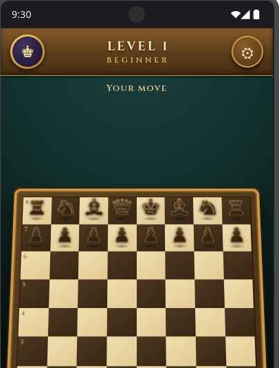

# ♟ MWM Chess (Android)

A clean, beginner-friendly chess game for Android, now on a **real-time 3D
board**. Free, open source, and made for people who are still learning the game:
pick up a piece and it shows you exactly where it can move. Play the computer at
four strengths or a friend on the same phone. No ads, no tracking, no network,
everything runs on-device.



*The new "royal wood & gold" design: a carved-wood set on a gilt board. Tap a
piece and its legal squares light up; captured pieces are lifted off the board
and lined up beside it. (Design preview; a device capture will replace this.)*

## 📲 Download

**[⬇ Latest APK (release)](https://github.com/Matswm86/mwm-chess/releases/latest/download/mwm-chess.apk)**

Sideload it: open the APK on your phone and allow *install from unknown
sources* when prompted. Android 8.0+ (minSdk 26).

Alternatively, every push builds a fresh debug APK in CI: *Actions → Build APK →
artifact `mwm-chess-debug`* (requires a GitHub login to download artifacts).

## Features

- **A real 3D board** — the pieces are a carved-wood glTF set rendered in real
  time with Google's Filament engine, on a gilt-framed board, viewed from a
  comfortable playing angle.
- **Captures leave the board** — a taken piece is removed from its square and
  lined up beside the board on the side of the player who captured it, so you
  can read the material balance at a glance.
- **Full, correct chess rules** — legal moves only, castling, en passant, pawn
  promotion (you pick the piece), check, checkmate, stalemate, plus draws by the
  50-move rule, threefold repetition, and insufficient material.
- **Play the computer** at four strengths: **Easy → Medium → Hard → Expert.**
  Easy sometimes plays a loose move so beginners can win; Expert searches deep
  and doesn't. Or play **two-player pass-and-play** on one device.
- **See every legal move** — tap a piece: reachable empty squares get a marker,
  pieces you can take get a ring, and your king glows red when it's in check.
- **A hint button** — asks the engine for the best move for your side.
- **Extras** — undo, resign, restart, change the computer's strength mid-game,
  a promotion picker, and sound effects for moves, captures, castling,
  promotion, check and game-over with a one-tap mute.
- **A "royal wood & gold" look** — set in the Cinzel typeface on a dark-green
  felt table, top to bottom.

## Screens

- **Menu** — choose mode (vs computer / two players), difficulty, and which
  colour you play.
- **Game** — the 3D board, a top bar with the current level and difficulty, a
  turn/status line with a material-lead badge, and an Undo / Hint / Restart /
  Resign bar. A settings gear changes difficulty, flips the board, toggles
  sound, or returns to the menu.

## The engine

A pure-Kotlin engine: **negamax + alpha-beta** with **quiescence search** and
**iterative deepening**, ordered by MVV-LVA, with a material + piece-square-table
evaluation. Difficulty scales the search depth and time budget (Easy also has a
small blunder chance); the AI runs off the UI thread so the board never freezes.

## Tech

Kotlin + Jetpack Compose (Material 3), single Activity, `minSdk 26`. The board is
rendered by **SceneView** (Google **Filament**); the source chess set is split
into a static board plus twelve instanced piece models under
`app/src/main/assets/models/`, placed and driven from the same game state as the
UI. Rules and move generation live in
`app/src/main/java/no/mwm/chess/engine/`, the search in `…/engine/ai/`, and the
Compose UI + 3D board in `…/ui/`. No game or chart libraries.

## Build locally

APKs are normally built in the cloud by **GitHub Actions** (see
`.github/workflows/android-build.yml`), so you don't need Android Studio. To
build on your own machine you need JDK 17 and the Android SDK:

```bash
gradle wrapper --gradle-version 8.7   # first time only, generates ./gradlew
./gradlew assembleDebug               # APK at app/build/outputs/apk/debug/
```

## License

**GPL-3.0-or-later** — see [`LICENSE`](LICENSE). The 3D chess set is
"Chess set" by brendan wood, used under **CC-BY-4.0**; UI text is set in
**Cinzel** (SIL Open Font License); 3D rendering uses **SceneView / Filament**
(Apache-2.0). Full attributions in [`NOTICE.md`](NOTICE.md). Free and open
source, made for learning rather than profit.
