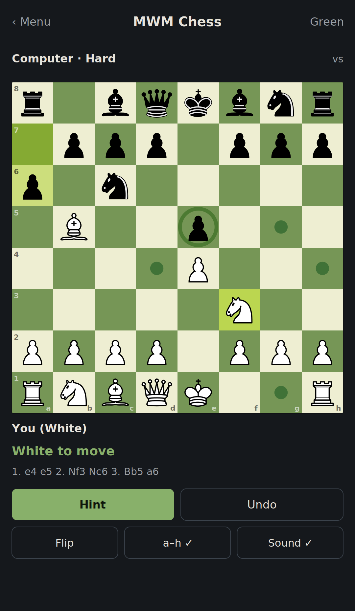

# ♟ MWM Chess (Android)

A clean, beginner-friendly chess game for Android, now on a **real-time 3D
board**. Free, open source, and made for people who are still learning the game:
pick up a piece and it shows you exactly where it can move. Play the computer at
four strengths, a friend on the same phone, or a friend on their own phone with
a 4-letter game code. No ads and no tracking. Only online games use the
network, and they send only the game code, a per-game token and the moves.



*The "royal wood & gold" look: a wood-and-gold top bar and a gilt-framed board
on a green felt table. (An early design preview. The pieces and the level label
have changed since; a device capture will replace it.)*

## 📲 Download

**[⬇ Latest APK (release)](https://github.com/Matswm86/mwm-chess/releases/latest/download/mwm-chess.apk)**

Sideload it: open the APK on your phone and allow *install from unknown
sources* when prompted. Android 8.0+ (minSdk 26). It is a rolling debug build of
`main`, replaced on every push.

Alternatively, every push to `main` also uploads a debug APK in CI: *Actions →
Build APK → artifact `mwm-chess-debug`* (requires a GitHub login to download
artifacts).

## Features

- **A real 3D board** — the pieces are a medieval glTF set (crowns, mitres and
  castle towers; silver for White, gold for Black) rendered in real time with
  Google's Filament engine, on a gilt-framed board, viewed from a comfortable
  playing angle.
- **Captures leave the board** — a taken piece is removed from its square and
  lined up beside the board on the side of the player who captured it, so you
  can read the material balance at a glance.
- **Full, correct chess rules** — legal moves only, castling, en passant, pawn
  promotion (you pick the piece), check, checkmate, stalemate, plus draws by the
  50-move rule, threefold repetition, and insufficient material.
- **Play the computer** at four strengths: **Easy → Medium → Hard → Expert.**
  Easy sometimes plays a loose move so beginners can win; Expert searches deep
  and doesn't. Or play **two-player pass-and-play** on one device.
- **Play a friend online** — one player taps *Create game* and gets a 4-letter
  code to share; the friend types it under *Join a friend's game*. Moves travel
  through a small room server at `chess.mwmai.no`, and both phones check every
  move with their own rules engine. After the game, *Rematch* swaps colours.
  Undo and Hint are turned off in online games.
- **See every legal move** — tap a piece: reachable empty squares get a marker,
  pieces you can take get a ring, and your king glows red when it's in check.
- **A hint button** — asks the engine for the best move for your side.
- **Extras** — undo, resign, restart, change the computer's strength mid-game,
  a promotion picker, and sound effects for moves, captures, castling,
  promotion, check and game-over, with a mute switch in the settings.
- **A "royal wood & gold" look** — set in the Cinzel typeface on a dark-green
  felt table, top to bottom.

## Screens

- **Menu** — choose mode (vs computer / two players on one phone / a friend
  online), difficulty, and which colour you play. Online mode shows *Create
  game* and *Join a friend's game* instead.
- **Game** — the 3D board, a top bar with the current level and difficulty, a
  turn/status line with a material-lead badge, and an Undo / Hint / Restart /
  Resign bar. A settings gear changes difficulty, flips the board, toggles
  sound, or returns to the menu. In an online game the top bar shows the game
  code, the bottom bar is Flip / Leave / Resign, and the gear has no difficulty.
- **Game code** (online only): after *Create game* the 4-letter code fills the
  screen with a *Share code* button until you tap *Continue*. A friend who joins
  sees a matching card first.

## The engine

A pure-Kotlin engine: **negamax + alpha-beta** with **quiescence search** and
**iterative deepening**, ordered by MVV-LVA, with a material + piece-square-table
evaluation. Difficulty scales the search depth and time budget (Easy and Medium
also play a random legal move on about 35% and 6% of their turns); the AI runs
off the UI thread so the board never freezes.

## Tech

Kotlin + Jetpack Compose (Material 3), single Activity, `minSdk 26`. The board is
rendered by **SceneView** (Google **Filament**): a static board plus twelve
instanced medieval piece models under `app/src/main/assets/models/`, placed and
driven from the same game state as the UI. Moves are animated in 3D: pieces glide
between squares, knights hop, and captured pieces are knocked off into a line-up
beside the board. Rules and move generation live in
`app/src/main/java/no/mwm/chess/engine/`, the search in `…/engine/ai/`, the
room-server client in `…/online/`, and the Compose UI + 3D board in `…/ui/`. No
game or chart libraries.

## Online rooms server

`server/server.py` is the room server behind `chess.mwmai.no`: one Python file,
standard library only, rooms kept in memory for up to 6 idle hours. It keeps the
move list, checks turn order, and relays moves to the other phone by long-poll;
it does not know the chess rules. Tests: `cd server && python3 -m unittest
test_server`. Deploy: `server/deploy.sh` (systemd user unit plus a Caddy block).

## Build locally

APKs are normally built in the cloud by **GitHub Actions** (see
`.github/workflows/android-build.yml`), so you don't need Android Studio. To
build on your own machine you need JDK 17 and the Android SDK:

```bash
gradle wrapper --gradle-version 8.7   # first time only, generates ./gradlew
./gradlew assembleDebug               # APK at app/build/outputs/apk/debug/
```

## License

**GPL-3.0-or-later** — see [`LICENSE`](LICENSE). The 3D pieces are
"0014_ Medieval HRE-ERE Chess Set" by Average3DmodelEnjoyer and the board is from
"Chess set" by brendan wood, both used under **CC-BY-4.0**; UI text is set in
**Cinzel** (SIL Open Font License); 3D rendering uses **SceneView / Filament**
(Apache-2.0). Full attributions in [`NOTICE.md`](NOTICE.md). Free and open
source, made for learning rather than profit.
